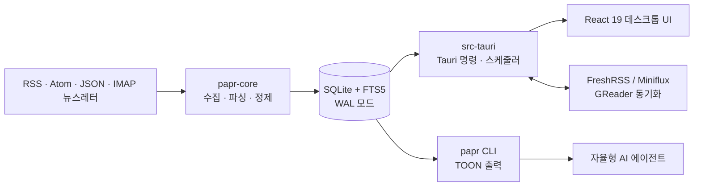

# Papr 레포지토리 분석

## 분석 기준

| 항목 | 값 |
| --- | --- |
| 원격 저장소 | `https://github.com/l0ng-ai/papr` |
| 분석 대상 | `main` 브랜치, `10949e8baf7475cec295acaa579f0d4d12068912` |
| 대상 커밋 | 2026-09-03 `feat: image dragging and zooming. (#132)` |
| 로컬 환경 | Windows, Node.js 24.13.0, Rust/Cargo 1.96.0 |
| 분석 방식 | 소스·설정·최근 이력·자동화 정의 검토 및 로컬 빌드/테스트 실행 |

## 한눈에 보기

Papr는 **로컬 우선(local-first) RSS 리더**다. 계정이나 자체 클라우드 없이 사용자의 컴퓨터에 SQLite 데이터베이스를 두고, 이를 다음 두 인터페이스가 함께 쓴다.

- React/Tauri 기반 데스크톱 앱: 읽기, 구독, 분류, AI, 번역, 오디오, OPML, FreshRSS 동기화 등을 제공한다.
- Rust 기반 `papr` CLI: AI 에이전트가 셸에서 피드와 기사를 읽고, 검색·분류·새로고침할 수 있도록 TOON 형식으로 출력한다.

두 인터페이스가 `papr-core` 크레이트와 단일 SQLite DB를 공유한다는 점이 이 프로젝트의 가장 중요한 설계 선택이다. 수집·파싱·마이그레이션·조회 로직이 한 곳에 있어 GUI와 CLI의 데이터 해석이 갈라질 가능성을 낮춘다.



## 구조와 책임

| 영역 | 규모 | 역할 |
| --- | ---: | --- |
| `src/` | 52개 파일, 약 12,037줄 | React 19 UI, Zustand 상태, TanStack Query/Virtual, i18n, 리더·목록·설정 컴포넌트 |
| `src-tauri/src/` | 10개 파일, 약 3,539줄 | Tauri IPC 명령, 앱 수명주기, 트레이, 알림, 백그라운드 스케줄러, 네이티브 페이지 뷰 |
| `crates/papr-core/src/` | 16개 파일, 약 9,545줄 | SQLite 데이터 계층, 피드/뉴스레터 수집, 정제·전문 추출, OPML, AI, 동기화 |
| `crates/papr-cli/src/` | 3개 파일, 약 2,496줄 | Clap CLI, TOON 렌더링, Codex/Claude/OpenCode 초기 연결 설정 |
| `extension/` | 5개 파일, 약 748줄 | Manifest V3 피드 탐지 및 `papr://subscribe` 딥링크 브라우저 확장 |

Rust 워크스페이스의 세 패키지는 `src-tauri`(데스크톱), `papr-core`(공유 코어), `papr-cli`(CLI)다. 루트 `Cargo.toml`이 데이터/네트워크 의존성 버전을 공유해 두 실행 파일이 같은 구현을 링크하도록 한다. 프런트엔드는 Vite + TypeScript로 별도 번들링되며 Tauri가 이를 네이티브 WebView에 탑재한다.

## 주요 동작

### 피드 수집과 읽기

- RSS·Atom·JSON 피드를 `feed-rs`로 읽으며 URL을 입력하면 피드를 자동 탐색한다. YouTube, Reddit, Mastodon, RSSHub 형식도 정규화한다.
- IMAP 뉴스레터를 별도 소스로 폴링해 일반 피드와 동일한 기사 모델로 넣는다.
- HTTP ETag/Last-Modified, 피드별 또는 전역 새로고침 주기, 프록시·타임아웃을 지원한다.
- 데스크톱 앱은 시작 뒤 8초부터 60초마다 만료된 피드만 확인하고, 단일 실행 잠금으로 수동/자동 새로고침이 겹치지 않게 한다.
- 기사 본문은 수집 시 정제하고, 필요하면 원문 페이지에서 전문을 추출한다. 검색은 SQLite FTS5 키워드 검색이다.

### 분류·동기화·개인화

- 폴더, 태그, 읽음/별표/나중에 읽기, 자동 규칙, 하이라이트와 메모를 제공한다.
- OPML 가져오기/내보내기와 FreshRSS·Miniflux(GReader API) 상태 동기화를 제공한다.
- 데스크톱 UI에는 요약·기사 질의·다이제스트·번역이 있으며 Anthropic, OpenAI, DeepSeek 및 OpenAI 호환 엔드포인트를 설정할 수 있다.
- CLI는 같은 DB에 대해 `feeds`, `list`, `read`, `search`, `mark`, `refresh`, `subscribe`, `opml`, `sync`, `admin` 등의 명령을 제공한다. AI 기능은 CLI를 구동하는 에이전트가 맡는다는 의도로 CLI 자체에는 중복 LLM 명령을 넣지 않았다.

## 데이터와 동시성 설계

`papr-core/src/db.rs`가 모든 SQL과 append-only 마이그레이션을 보유한다. 핵심 테이블은 `folders`, `feeds`, `articles`, `enclosures`, `settings`이며, 여기에 FTS5 `articles_fts`, 동기화 대기열, 태그/규칙, 뉴스레터 소스, 하이라이트, 번역 캐시, 보존 삭제 tombstone이 추가된다.

쓰기 연결은 SQLite **WAL** 모드, foreign key, 5초 busy timeout을 설정하고 마이그레이션을 적용한다. UI는 4개의 `query_only` 읽기 연결 풀을 별도로 열어 백그라운드 수집 중에도 목록 조회가 쓰기 잠금에 덜 막히도록 했다. 이는 단일 로컬 DB를 공유하는 앱/CLI 구조에서 실용적인 선택이다.

## 품질과 자동화

GitHub Actions는 PR과 `main` 푸시에서 다음을 수행하도록 정의돼 있다.

- 프런트엔드: Node 22, pnpm 9, `pnpm install --frozen-lockfile`, `pnpm build`, `pnpm test`
- Rust: Linux 시스템 WebView 의존성을 설치한 뒤 `cargo check --manifest-path src-tauri/Cargo.toml --all-targets`와 `cargo test --manifest-path src-tauri/Cargo.toml`
- 릴리스: macOS(ARM/Intel), Linux, Windows 번들 및 각 플랫폼의 `papr` CLI 바이너리를 빌드한다. macOS 앱과 CLI에는 코드 서명·공증 흐름이 있다.

### Codex OAuth 및 hook 호환성 점검

Codex는 ChatGPT 계정 로그인과 API 키 로그인을 모두 지원하며, 로컬 CLI에서 `codex login`을 실행하면 브라우저 로그인 흐름으로 자격 증명이 반환된다. 따라서 Papr를 Codex와 함께 쓸 때 별도의 OpenAI API 키를 Papr에 넣을 필요는 없다. Papr CLI는 로컬 DB를 읽고, OAuth로 로그인한 Codex가 기사 내용을 분석하는 역할을 맡으면 된다.

분석 대상 기준 커밋의 `papr setup --app codex`는 `~/.codex/hooks.json` 최상위에 `SessionStart` 배열과 단일 command handler를 직접 기록했다. 현재 Codex hook 스키마는 최상위 `hooks` 객체 안에 이벤트를 두고, **matcher group → handler 배열**로 한 단계 더 중첩해야 한다. Codex 공식 문서는 `~/.codex/hooks.json`을 지원 위치로 안내하지만, 기준 커밋이 쓰던 JSON 형태는 그 형식과 달랐다.

이번 작업 트리에서는 `crates/papr-cli/src/setup.rs`를 최신 형식으로 수정했다. `papr setup --app codex`는 기존의 올바른 hook을 보존하고, 이전 Papr의 평면 `SessionStart` 형식은 새 matcher group으로 마이그레이션한다. 기존 Papr handler는 중복하지 않고 갱신하며, 공백이 있는 Windows 바이너리 경로도 인용 처리한다. 새로 만드는 hook의 형태는 아래와 같다. `PAPR_EXE`는 영구적으로 설치한 `papr.exe`의 절대 경로로 바꾼다.

```json
{
  "description": "Load Papr dashboard when a Codex session starts.",
  "hooks": {
    "SessionStart": [
      {
        "matcher": "startup|resume",
        "hooks": [
          {
            "type": "command",
            "command": "PAPR_EXE",
            "timeout": 10,
            "additionalContextLimit": 1200
          }
        ]
      }
    ]
  }
}
```

Codex는 새 user hook을 실행하기 전 해당 hook 정의의 검토·신뢰를 요구한다. 설정 뒤 Codex CLI의 `/hooks`에서 내용을 확인하고 신뢰해야 한다. 이 문제는 OAuth 인증 문제가 아니라 Papr의 최신 Codex hook 포맷 추적 문제다.

로컬 확인 결과:

| 검증 | 결과 | 비고 |
| --- | --- | --- |
| TypeScript 검사 및 Vite 프로덕션 빌드 | 통과 | `dist/` 생성 확인 |
| Vitest | 통과 | 5개 테스트 파일, 76개 테스트 전체 통과 |
| Rust CI 명령 `cargo test --manifest-path src-tauri/Cargo.toml` | 통과 | 데스크톱 크레이트 30개 테스트 통과 |
| Rust 전체 `cargo test --workspace` | 통과 | 데스크톱 30개 + CLI 17개 + 공유 코어 216개, 총 263개 통과 |

소스에는 Rust 단위 테스트 263개가 있고, 프런트엔드/확장 테스트는 뷰포트·번역 행 매핑·하이라이트 앵커·이미지 바이트·피드 탐지를 다룬다. CI의 현재 Rust 테스트 명령은 데스크톱 크레이트 30개만 실행한다. 전체 263개 검증에는 `cargo test --workspace`가 필요하다. 또한 실제 WebView를 포함한 Tauri IPC 통합 테스트나 브라우저 E2E 테스트 구성은 찾지 못했다.

## 장점

1. **공유 코어가 분명하다.** 데스크톱과 CLI가 같은 DB 스키마와 수집 코드에 의존하므로 기능 차이를 줄인다.
2. **로컬 우선 원칙이 일관적이다.** DB, 검색, 규칙, 기사 상태가 로컬에서 처리되며 네트워크 의존은 수집·동기화·선택적 AI에 국한된다.
3. **성능을 의식한 구현이 있다.** FTS5, WAL, 읽기 풀, 목록 가상화, 조건부 HTTP 요청, 수집 단일 실행 잠금이 확인된다.
4. **에이전트 인터페이스가 구체적이다.** CLI는 짧은 기본 스키마, 명확한 빈 결과·집계, 멱등 상태 변경, stdout TOON/stderr 진단, 종료 코드를 고려했다.
5. **신뢰 경계에 기본 방어가 있다.** RSS·뉴스레터·전문 추출 HTML은 Rust `sanitize` 모듈을 거치고, 악성 이벤트 속성·스크립트·URL 관련 사례를 다루는 단위 테스트가 존재한다.

## 개선 우선순위

| 우선순위 | 관찰 | 권장 조치 |
| --- | --- | --- |
| 높음 | `tauri.conf.json`의 CSP가 `null`이고 리더는 `dangerouslySetInnerHTML`을 사용한다. 현재 Rust 백엔드 정제가 방어하지만, 피드 HTML은 본질적으로 비신뢰 입력이다. | Tauri/웹뷰에 맞는 최소 CSP를 단계적으로 도입하고, 정제 정책의 회귀·퍼즈 테스트 및 보안 검토를 유지한다. |
| 높음 | AI API 키(`settings`), FreshRSS 인증 값(`settings`), IMAP 비밀번호(`newsletter_sources`)가 앱 DB에 저장되는 구조다. | OS 키체인/credential vault 사용을 검토하거나, 최소한 평문 저장과 백업 시 비밀 노출 가능성을 문서화한다. |
| 중간 | 프런트엔드 주 번들이 588.20 kB(압축 180.46 kB)로 Vite의 500 kB 경고를 넘는다. | 설정·AI·리더·라이트박스 등 진입 빈도가 낮은 화면을 `lazy`/동적 import로 분리하고 번들 크기를 CI 지표로 추적한다. |
| 중간 | CI의 Rust 테스트는 데스크톱 크레이트 30개만 실행해, 공유 코어·CLI의 나머지 229개 단위 테스트가 PR 검증에서 빠진다. UI-IPC-DB를 관통하는 E2E 자동화도 보이지 않는다. | CI에 `cargo test --workspace`를 추가하고, 임시 SQLite DB와 mock HTTP/IMAP/GReader 서버를 이용한 통합 테스트 및 WebDriver 기반 핵심 UI 흐름 테스트를 추가한다. |
| 낮음 | `src/App.tsx`와 `papr-core/src/db.rs`에 책임이 많이 모인다. | 새 기능 추가 시 화면 상태·명령 도메인·DB 조회를 더 작은 모듈로 나눠 변경 충돌과 회귀 범위를 줄인다. |

## 개발 시작점

```powershell
# JavaScript 의존성 및 프런트엔드 검증
pnpm install --frozen-lockfile
pnpm build
pnpm test

# Rust 검증 및 데스크톱 개발 실행
cargo test --manifest-path src-tauri/Cargo.toml
pnpm tauri dev

# 에이전트용 CLI 빌드
cargo build --release -p papr-cli
```

Windows에서는 WebView2 Runtime과 Rust MSVC 빌드 도구가 필요할 수 있다. Linux CI에서 쓰는 WebKitGTK, AppIndicator, librsvg, patchelf 의존성도 각 배포판 환경에 맞춰 설치해야 한다.

## 결론

Papr는 일반 RSS 리더에 그치지 않고, **사람용 네이티브 UI와 에이전트용 CLI를 동일한 로컬 데이터 모델 위에 올린 제품**이다. 구조의 응집도와 기능 범위, 릴리스 자동화는 좋은 편이다. 다음 투자 우선순위는 비신뢰 HTML을 다루는 WebView 보안 경계 강화, 로컬 자격 증명 보호, 그리고 실제 앱 경로를 확인하는 통합/E2E 테스트 확장이다.
