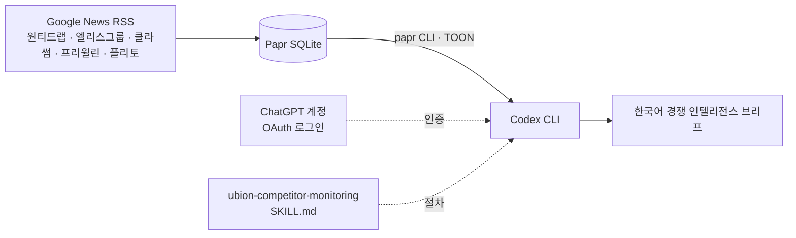

# GPT OAuth 기반 운영 방식과 인사이트

이 문서는 Ubion 경쟁사 모니터링에 Papr를 쓰는 방식을 규정한다. 핵심은 **분석 모델(GPT)을
OpenAI API 키가 아니라 ChatGPT 계정 OAuth 로그인으로 사용**한다는 점이다. Papr에는
어떤 LLM 자격 증명도 저장하지 않으며, Papr는 데이터 계층만 맡는다.

관련 문서: [레포지토리 분석](../REPOSITORY_ANALYSIS.md) · [CLI 레퍼런스](cli.md) ·
[경쟁사 모니터링 스킬](../skills/ubion-competitor-monitoring/SKILL.md)

## 1. 운영 방식 규정

### 1.1 역할 분리

| 계층 | 담당 | 자격 증명 |
| --- | --- | --- |
| **Papr** (데스크톱 앱 · `papr` CLI · SQLite) | 경쟁사 뉴스 RSS 수집, 저장, 검색, 읽음/별표 상태 | 없음 — 로컬 DB만 사용 |
| **Codex CLI** (GPT) | 기사 읽기·요약·경쟁 분석·브리프 작성 | **ChatGPT OAuth** (`codex login`) |
| **스킬** (`skills/`) | 분석 절차와 산출물 형식 | 없음 — 텍스트 지침 |



### 1.2 인증 규정

1. **OpenAI API 키를 사용하지 않는다.** Papr 설정(`ai_api_key` 등)과 저장소 어디에도
   OpenAI 키를 넣지 않는다. GPT 사용량은 ChatGPT 구독 플랜에 귀속된다.
2. **인증은 `codex login` 한 가지 경로만 쓴다.** 브라우저 로그인 흐름으로 발급된
   자격 증명은 Codex가 사용자 홈의 `.codex` 디렉터리에 보관한다. 이 디렉터리를
   저장소에 커밋하거나 다른 사람과 공유하지 않는다.
3. **세션 만료 시 재로그인한다.** Codex가 인증 오류를 내면 키를 발급받는 대신
   `codex login`을 다시 실행한다.
4. **Papr의 AI 설정은 비워 둔다.** 데스크톱 앱의 요약·번역 기능은 별도 키가 필요하므로
   이 워크플로에서는 사용하지 않는다. 요약·번역·분석은 모두 Codex가 수행한다.

### 1.3 데이터 경계

- 기사 제목·본문은 Codex가 읽는 순간 OpenAI로 전송된다. 공개 뉴스만 대상으로 하며,
  내부 문서·비공개 자료를 같은 세션에서 함께 다루지 않는다.
- 스킬은 **읽기 전용이 기본**이다. 사용자가 명시하지 않으면 피드 구독, 읽음 상태,
  태그를 바꾸지 않는다(`ubion-competitor-monitoring` 스킬 규칙).
- 산출물(브리프)은 출처 URL·발행일·매체를 반드시 포함해 검증 가능해야 한다.

### 1.4 설치 절차

```powershell
# 1) Papr CLI 설치 후 경쟁사 Google News RSS 구독
papr subscribe "https://news.google.com/rss/search?q=원티드랩&hl=ko&gl=KR&ceid=KR:ko"
papr subscribe "https://news.google.com/rss/search?q=엘리스그룹&hl=ko&gl=KR&ceid=KR:ko"
papr subscribe "https://news.google.com/rss/search?q=클라썸&hl=ko&gl=KR&ceid=KR:ko"
papr subscribe "https://news.google.com/rss/search?q=프리윌린&hl=ko&gl=KR&ceid=KR:ko"
papr subscribe "https://news.google.com/rss/search?q=플리토&hl=ko&gl=KR&ceid=KR:ko"

# 2) Codex를 ChatGPT 계정으로 로그인 (API 키 없음)
codex login

# 3) Codex 세션 시작 시 Papr 대시보드가 자동으로 컨텍스트에 들어오도록 hook 연결
papr setup --app codex
#    → Codex CLI에서 /hooks 를 열어 새 hook을 검토·신뢰해야 실행된다.

# 4) 스킬 설치
npx skills add https://github.com/l0ng-ai/papr/tree/main/skills/papr-rss
npx skills add https://github.com/l0ng-ai/papr/tree/main/skills/ubion-competitor-monitoring
```

이후 Codex에서 "이번 주 경쟁사 동향 브리프"처럼 요청하면 스킬이 `papr refresh` →
`papr list/read` → 분석 → 한국어 브리프 순서로 진행한다.

## 2. 인사이트

### 2.1 Codex hook 스키마 변경 대응

기준 커밋의 `papr setup --app codex`는 `~/.codex/hooks.json` 최상위에 평면
`SessionStart` 배열을 기록했지만, 현재 Codex는 `hooks → 이벤트 → matcher group →
handler` 구조를 요구한다. 이번 작업 트리의
[`crates/papr-cli/src/setup.rs`](../crates/papr-cli/src/setup.rs)는 다음을 보장한다.

- 새 스키마(`matcher: "startup|resume"`, `timeout`, `additionalContextLimit`)로 기록
- 이전 평면 형식을 발견하면 삭제하지 않고 새 matcher group으로 **마이그레이션**
- 다른 도구의 hook은 보존, 기존 Papr hook은 중복 없이 경로만 갱신
- 공백이 있는 Windows 경로(`C:\Program Files\...\papr.exe`)는 따옴표로 감싼다

이는 OAuth 인증 문제가 아니라 **Codex hook 포맷 추적 문제**였다. 인증이 정상인데
세션 시작 시 대시보드가 보이지 않으면 `~/.codex/hooks.json` 형식과 `/hooks` 신뢰
여부를 먼저 확인한다.

### 2.2 데스크톱 앱 없이 UI 미리보기 (브라우저 모드)

`pnpm dev`로 띄운 Vite 서버(`http://localhost:1430`)를 **일반 브라우저**에서 열어도
실제 경쟁사 기사가 보이도록 했다. Tauri IPC가 없는 환경에서 UI를 검토하거나 데모할 때
쓴다.

| 구성 요소 | 파일 | 역할 |
| --- | --- | --- |
| 읽기 전용 뉴스 API | [`vite.config.ts`](../vite.config.ts) | `/api/competitor-news` — 5개 경쟁사 Google News RSS를 서버에서 가져와 Papr의 `Feed`/`ArticleSummary` 형태로 반환 (5분 캐시, `?refresh=1`로 강제 갱신) |
| 브라우저용 명령 브리지 | [`src/lib/previewBridge.ts`](../src/lib/previewBridge.ts) | `list_feeds`, `list_articles`, `get_article`, `smart_counts`, `mark_*`, `refresh_feeds` 등 UI가 보내는 Tauri 명령을 위 API 데이터로 응답 |
| invoke 래퍼 | [`src/lib/invoke.ts`](../src/lib/invoke.ts) | Tauri 안에서는 실제 IPC, 브라우저에서는 브리지로 라우팅. `Channel`은 브라우저에서 생성조차 불가하므로 대체 `channel()` 제공 |
| 플랫폼 감지 | [`src/lib/platform.ts`](../src/lib/platform.ts) | `isTauri` — 창 배경색, 트레이 이벤트, 업데이트 확인 등 네이티브 전용 호출을 가드 |

제약 사항:

- 읽음/별표/나중에 읽기 상태는 **메모리에만** 있어 새로고침하면 초기화된다.
- 본문 추출, AI, 번역, 동기화, OPML 등 네이티브 전용 명령은 명확한 오류 메시지로 거부한다.
- Google News RSS의 `<description>`은 XML 엔티티로 이스케이프된 HTML이라 **엔티티 해제 →
  태그 제거** 순서로 파싱해야 한다. 순서가 바뀌면 목록에 `<a href=...` 원문이 노출된다.
  또한 제목 끝의 `" - 매체명"` 접미사는 출처 열과 중복되므로 제거했다.

### 2.3 아키텍처에서 얻은 교훈

- **공유 코어의 가치.** 데스크톱 앱과 CLI가 `papr-core`와 하나의 SQLite를 공유하므로,
  Codex가 CLI로 읽는 기사와 사람이 앱에서 보는 기사가 항상 같다. 브라우저 미리보기만
  예외적으로 별도 데이터 경로를 쓰며, 이 점을 화면에 명시한다.
- **로컬 자격 증명 최소화.** 레포지토리 분석에서 AI 키·FreshRSS·IMAP 비밀이 앱 DB에
  평문 저장되는 점이 개선 항목으로 나왔다. OAuth 기반 운영은 이 표면을 아예 만들지
  않는 선택이다.
- **WAL + 읽기 연결 풀.** 백그라운드 수집 중에도 CLI 조회가 잠금에 덜 막히므로, Codex
  세션이 `papr refresh` 직후 `papr list`를 연달아 호출해도 안정적이다.
- **TOON 출력.** JSON 대비 약 40% 적은 토큰으로 기사 목록을 넘기므로, 5개 경쟁사
  × 20건씩 100건을 한 세션 컨텍스트에 올려도 여유가 있다.

### 2.4 남은 과제

| 우선순위 | 항목 |
| --- | --- |
| 높음 | 스킬 산출물(브리프)을 파일로 남기는 규칙 — 현재는 대화 출력에만 존재 |
| 중간 | 브라우저 미리보기의 경쟁사 목록이 `vite.config.ts`에 하드코딩됨 → 환경 변수 또는 JSON으로 분리 |
| 중간 | CI의 Rust 테스트가 데스크톱 크레이트만 실행 → `cargo test --workspace` 추가 |
| 낮음 | `tsconfig.node.json`에 `lib`가 없어 `vite.config.ts` 단독 타입 검사가 ES5 기준으로 실패(실행에는 영향 없음) |

## 3. 검증 기록 (2026-09-11)

| 검증 | 결과 |
| --- | --- |
| `tsc --noEmit` (프론트엔드) | 통과 |
| `vitest run` | 5개 파일 76개 테스트 통과 |
| `/api/competitor-news` | 5개 피드, 기사 100건 반환 |
| 헤드리스 Edge로 `http://localhost:1430/` 렌더링 | 사이드바에 5개 경쟁사 피드, 목록에 실제 기사 표시 확인 |
